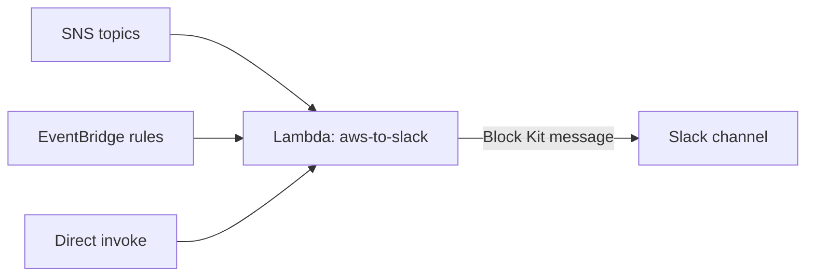

<div align="center">
  

  <h1>aws-lambda-aws-to-slack</h1>

  <p>
    <strong>Forward AWS service notifications to Slack as formatted incoming-webhook messages.</strong>
  </p>

  <p>
    <a href="https://github.com/dmitryint/aws-lambda-aws-to-slack/actions/workflows/test.yml"></a>
    <a href="https://github.com/dmitryint/aws-lambda-aws-to-slack/releases/latest"></a>
    <a href="https://goreportcard.com/report/github.com/dmitryint/aws-lambda-aws-to-slack"></a>
    <a href="https://github.com/dmitryint/aws-lambda-aws-to-slack/blob/main/LICENSE"></a>
    
    
  </p>
</div>

---

## Why this exists

AWS services emit operational events through many transports — SNS topics, EventBridge rules, direct Lambda invocations — and each one has its own JSON shape. Wiring every team's Slack channel to every AWS service usually devolves into a graveyard of single-purpose Lambdas, each one re-implementing the same envelope unwrapping, the same KMS-decrypted webhook URLs, and the same Block Kit message scaffolding.

This Lambda is the one binary you wire up once:

1. Subscribe it to any number of SNS topics or EventBridge rules.
2. It normalizes the envelope (SNS / EventBridge / direct), routes the inner payload through an ordered parser waterfall, and renders one Slack message per record.
3. Unknown payloads fall through to a generic formatter rather than being dropped.



## Features

- One binary, many sources — Auto Scaling, AWS Health, AWS Batch, Elastic Beanstalk, CloudFormation, CloudWatch alarms, CodeBuild, CodeCommit, CodeDeploy, CodePipeline, ECS, GuardDuty, Inspector / Inspector2, RDS, SES, with a generic fallback for anything else.
- Native Slack Block Kit output with consistent header / fields / link layout across sources.
- CloudWatch alarms render the `AlarmDescription` as a section block and embed a live metric chart image hosted in S3 with configurable TTL.
- KMS-encrypted `SLACK_HOOK_URL` and `SLACK_CHANNEL` are auto-detected by ciphertext magic bytes and decrypted at cold start.
- DynamoDB-backed dedup for Inspector2 findings so a single scan never spams a channel.
- Optional fire-and-forget suppression of AWS console links via `HIDE_AWS_LINKS`.
- Single static binary, `provided.al2023` runtime, supports `arm64` and `x86_64`.

## Supported sources

Auto Scaling, AWS Health, AWS Batch, Elastic Beanstalk, CloudFormation, CloudWatch alarms, CodeBuild, CodeCommit (pull-request + repository), CodeDeploy (SNS + EventBridge), CodePipeline (state changes + manual approval), ECS, GuardDuty, Inspector (classic), Inspector2, RDS, SES (bounce / complaint / received). Anything else falls through to the generic formatter.

Representative event payloads for every supported source are committed under [`samples/`](samples/) and are the canonical record used by the parser tests.

## Quick start (OpenTofu / Terraform)

[`examples/lambda/`](examples/lambda) is a reference module that declares the Lambda function, execution role, and the base inline IAM the binary needs (KMS decrypt, S3 chart-bucket access, DynamoDB dedup, CloudWatch `GetMetricWidgetImage`). Wire your event sources — SNS subscriptions, EventBridge targets — per the recipes in `examples/lambda/README.md`.

```hcl
module "aws_to_slack" {
  source = "./examples/lambda"

  function_name       = "aws-to-slack"
  slack_hook_url      = var.slack_hook_url_ciphertext   # base64 KMS ciphertext
  kms_decrypt_key_arn = aws_kms_key.slack.arn
  chart_bucket_name   = aws_s3_bucket.charts.bucket
  dedup_table_name    = aws_dynamodb_table.dedup.name
}
```

## Configuration

| Env var               | Purpose                                                          |
|-----------------------|------------------------------------------------------------------|
| `SLACK_HOOK_URL`      | Incoming-webhook URL. Plaintext or KMS-encrypted ciphertext.     |
| `SLACK_CHANNEL`       | Override channel (optional). Plaintext or KMS ciphertext.        |
| `CHART_BUCKET_NAME`   | S3 bucket for CloudWatch alarm chart images.                     |
| `CHART_BUCKET_REGION` | Region of the chart bucket (may differ from `AWS_REGION`).       |
| `CHART_URL_TTL`       | Pre-signed URL TTL for chart images (Go duration, e.g. `15m`).   |
| `CHART_SSE_ALGORITHM` | Optional S3 SSE algorithm for uploaded charts (`AES256`/`aws:kms`). |
| `DEDUP_TABLE_NAME`    | DynamoDB table for Inspector2 finding dedup.                     |
| `DEDUP_TTL_DAYS`      | TTL on dedup entries.                                            |
| `HIDE_AWS_LINKS`      | `true` or `1` suppresses AWS console links in rendered messages. |

`SLACK_HOOK_URL` and `SLACK_CHANNEL` may be set as plaintext or as a base64-encoded KMS ciphertext blob. Ciphertext is detected by its leading magic bytes (`0x01 0x02`) after base64 decoding and decrypted at cold start. Decryption failures fail the cold start so the configured CloudWatch alarm on Lambda Errors triggers.

## IAM policy for the Lambda role

```json
{
  "Version": "2012-10-17",
  "Statement": [
    {
      "Effect": "Allow",
      "Action": "kms:Decrypt",
      "Resource": "<kms-key-arn-for-slack-secrets>"
    },
    {
      "Effect": "Allow",
      "Action": ["s3:PutObject", "s3:GetObject"],
      "Resource": "<chart-bucket-arn>/*"
    },
    {
      "Effect": "Allow",
      "Action": ["dynamodb:GetItem", "dynamodb:PutItem"],
      "Resource": "<dedup-table-arn>"
    },
    {
      "Effect": "Allow",
      "Action": "cloudwatch:GetMetricWidgetImage",
      "Resource": "*"
    }
  ]
}
```

Plus the standard `AWSLambdaBasicExecutionRole` for CloudWatch Logs. Trim resource ARNs and individual statements to match the features you actually use (e.g. omit the KMS statement if you wire `SLACK_HOOK_URL` as plaintext).

## Releases

Each tagged GitHub Release ships two ready-to-use Lambda zip artifacts:

- `lambda-aws-to-slack_<version>_linux_amd64.zip`
- `lambda-aws-to-slack_<version>_linux_arm64.zip`

Each artifact has a matching `.zip.sha256` for verification. Pin a version in your Terraform / OpenTofu config and download via `archive_file`, `null_resource` + `curl`, or by uploading to S3.

## Building from source

```sh
git clone https://github.com/dmitryint/aws-lambda-aws-to-slack.git
cd aws-lambda-aws-to-slack
make package          # builds amd64 + arm64 zips into ./package
make test             # runs unit tests with -race
```

## Layout

- `cmd/aws-to-slack/` — Lambda entrypoint (`bootstrap` for `provided.al2023`).
- `internal/handler/` — wires envelope → router → Slack sinks.
- `internal/envelope/` — Lambda payload shape normalization.
- `internal/router/` — ordered parser waterfall.
- `internal/parser/<source>/` — per-AWS-service parsers.
- `internal/slack/` — webhook client and Block Kit message envelope.
- `internal/console/`, `internal/dedup/`, `internal/kms/`, `internal/config/` — supporting packages.
- `samples/` — committed event fixtures used by parser tests.
- `examples/lambda/` — OpenTofu / Terraform example showing how to wire the binary up.

## Contributing

Issues and pull requests are welcome. See [CONTRIBUTING.md](CONTRIBUTING.md) for the development workflow, coding conventions, and PR checklist.

## License

[MIT](LICENSE) © 2026 Dmitry K.
